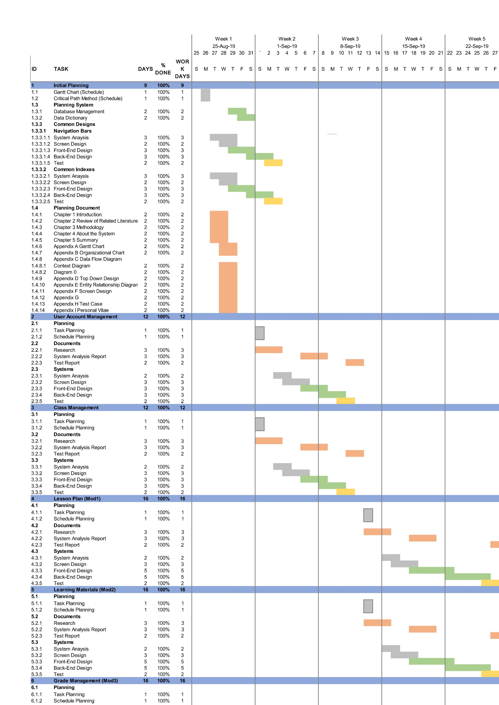

# Web Based Central Philippine University Senior High School Class Management System

### A Capstone Project Presented to The Faculty of Central Philippine University College of Computer Studies

###  In Partial Fulfillment Of the Requirements for the Course in CCS 4100 – CCS Thesis II

By Ryuichi Egoshi

## INTRODUCTION

### Overview of the Current State

Not long ago, the concept of senior high school was a blur. High school only lasted for four years and before that, most schools had only six or seven years for grade school. Since the implementation of the K-12 system in the Philippines, the whole pre-university educational system had changed. What used to be only ten years of studying has now become twelve, with the two additional years now being referred to as ‘Senior High School’ or SHS. This new educational system is compulsory for all private and public schools. All private and public schools in the Philippines must start the classes that manages 200-day school calendar of the Department of Education. Senior High School (SHS) refers to Grades 11 and 12, the last two years of the K-12 program that the Department of Education has implemented since 2012. Students begin to study at Senior High School the subjects that will introduce them to their preferred career path.

Since technology is changing the methods through which education is delivered, schools are confronting formations which affect the nature of the courses and degree program they offer. These innovations have also driven the growth of opportunities for distance learning. Students who are time-bound due to geographic location, have personal responsibilities, and physical disabilities can now access the courses and degree programs at their convenience. 

The current system of the Senior High School department gives out quizzes and exams both written and online. For the online quizzes and exams, there is currently no system being developed exclusively. In their current state, the Senior High School Director does not have a soft copy of the final grades of the students. When distributing learning materials, a hand-out is given to a student representative and being passed on to their classmates. Students also have the means to alter their grades before giving it to their parents.

### Desire State of Technology

The study desire to create and develop a Web Based Central Philippine University Senior High School Class Management System. A program that will be exclusively made for the Senior High School department to be mainly used by Senior High School Director, teacher, students as well as their parents. This program will be able to facilitate the students in tracking their lesson plans and give an easy access for the learning materials needed in studying. This program shall be made in a systematized manner to ensure that teachers will not have difficulty in using it, a user manual shall also be provided.
The compulsory grading system of the Department of Education for the Senior High School shall also be implemented when making an automated grade for each student.

### Statement of the Problem

During analysis, the proponent was able to note the following:

1.	Lesson plan for every subject and manually given which the students might either misplace or have lost it
2.	There is difficulty in distributing learning materials to the students namely slides and word documents because of certain limit like passing of the files from one student to the other.
3.	The current system being used in taking quizzes and exams online was not made exclusively fir the Senior High School Department.
4.	There is difficulty in providing the parents the current grades per grading period and number of absences of their children because it is not all the time that they will be able to go to school especially for personal reasons.
5.	The current system does not provide copy of final grades of students.

### Objectives of the Study

General Objective:
This study aims to design and develop a Web Based Central Philippine University Senior High School Class Management System.

### Specific Objective:

This study aims to create;
-	A module that will create lesson plans for the subject in order for the students to keep track on what they will study.
-	A module that will include uploading and downloading of learning materials for the students.
-	A module that will create online quizzes and exams made exclusively for Senior High School department.
-	A module that will provide the parents the current grades per grading period and number if absences of their children.
-	A module that will create report generator as PDF to give the teacher of final grades of the students.

### Theoretical Framework

(Figure 1.0 Theoretical Framework Diagram)

Figure 1.0 shows the holistic theoretical framework for the development of the Web Based Central Philippine University Senior High School Class Management System. The holistic theoretical framework was constructed upon the three main components of an information system: people, technology, and services provided by technology itself. Guided by these main pillars we revise and identify the users and their interaction with the system. We then present the classification of the technological considerations to these kinds of system, focusing more on the contents type and ways of communication, than on providing a list of the platforms existing.

**Software**. Different front-end and back-end software will be used in creating the system. Front-end or the client-side is the design part of the system where the users interact directly. The proposed languages to be used on the front-end are HTML5, CSS, JavaScript, jQuery, Bootstrap, SASS, Node.js, VUE.js, and NPM. Back-end or the server-side handles the functionality of the system. It focuses in making updates and necessary changes to enhance security. The languages to be used for the back-end are PHP7, Laravel, Composer, MySQL, and XAMPP.

**Features**.  The features are the primary objectives of the system that must be performed and delivered by the intended users. Each user has their own set of features. Access on each features shall be circumscribed depending on the user who tries to access it. 

The following are the features included in the system:
- Login - The authorization method used by the system which the user shall input their registered unique email and password.
- Generate Access Code - An access code will be generated automatically to be used whenever a student enrolls in a certain subject.
- View Account Details – Allows users to check their account settings.
- Account Lists - Shows all the accounts registered. The admin can view and delete teacher accounts while the teachers can view and delete student accounts.
- Accept Accounts - An admin and teacher function in accepting accounts that register in the system.
- Section Catalog - List all the sections of Senior High School department.
- Classmate - Classmate function allows the students to view the names of their classmates in every section.
- Subject Catalog - Allows the students and teachers to view the subject enrolled.
- Enrollment - The Enrollment function allows the students to enroll on their respective subjects after being created by the teacher.
- Dashboard - The Dashboard allows the students to view all their ongoing classes for the semester and the classes completed.
- View Class - The View Class function allows the students to view the class they have enrolled.
- Lessons - List of the lesson plans handed out by the teachers for each subject.
- Tasks - This function allows the teachers to create all activities – written work, performance task, and quarterly assessment.
- Class Online Quiz - used by the students when taking an online quiz.
- Class Resource - The Class Resource function allows the teachers to upload learning materials for the students to view or download. A resource material can only be viewed or downloaded on its designated subject.
- Attendance - A system function used by the teachers in checking the student attendance in every class. This function can also be viewed by the students and parents.
- Grading - A system function where the students and parents may view the grades for every class.
- Private Resource - A system function that students use in uploading resource materials on their accounts.
- Generate Online Quiz - A system function used by the teachers when giving online quizzes to the students.

**Users**. The users are the people who are going to use the system, namely the Admin, Teachers, Students, and Parents.

**Process**. In order for the system to be carried out, there is a process to be developed. In making the system, researchers should conduct a thorough research to collect the necessary data that are needed. Gathering these data is a major condition in this system. After analyzing these data, proper programming will be applied. During implementation, imposing strict maintenance shall be made for securing all data within the system.

### Conceptual Framework

(Figure 2.0 Conceptual Framework Diagram)

Central Philippine University Senior High School Class Management System. Our group have applied the design of the system according to the conceptual framework.
A conceptual framework is a diagram that visually represents and interprets the underlying theory, principles, and concepts of a research. It is a visual presentation of variables that interrelate with one another as perceived by the researchers before an actual empirical investigation is done to prove its relationship. This consists of concepts that are placed within a logical and sequential design. It represents the less formal structure and used for studies in which existing theory is inapplicable or insufficient. It is based on specific concepts and propositions, derived from empirical observation and intuition. The purpose of the conceptual framework is to clarify concepts and propose relationships among the concepts in a study. It is used to provide a context for interpreting the study findings, to explain observations, and to encourage theory development that is useful to practice.

**Hosting Server**. The hosting server is composed of the system to be implemented. It will be accessed by intended users via online.

**Security**. This study includes security feature that provide a method of authentication. In this authentication system method, it allows the user to go through the login/logout services. It is a common method of authentication which allows only authorized users to access data, information, and control the functions of the system.

**Users**. 	The users which are mainly composed of the Admin, Students, Teachers and Parents are the ones who are going to have the benefit to make use of the system to be implemented.
RDBMS. RDBMS (Relational Database Management System) is structured in database tables, fields and records. Each RDBMS table consists of database table rows. Each database table row consists of one or more database table fields. RDBMS store the data into collection of tables, which might be related by common fields. RDBMS also provide relational operators to manipulate the data stored into the database tables.

### Scope and Limitations

The system to be developed is intended for Central Philippine University Senior High School. The purpose of the system is to provide an exclusive learning management system for the department. The system will be used by the teachers to give online quizzes and exams as well as making lesson plans and uploading downloading learning materials to provide the students on what to study. For the students on the other hand, they will be able to use the system in takin online quizzes and exams, viewing the lesson plans and downloading the learning materials that they need. The system allows the parents to view the current grades and the number of absences of their children. The Senior High School director who will be made as the admin can manage all accounts along with checking the user and activity logs.

The system will only cover the subjects and area under the Senior High School department. The system can only be accessed with internet connection.

### Significance of the Study

The purpose of the system is to precisely monitor the performance of the students. The system can also give the parents an update of the current grading status and the number of absences made by their children. The class teacher can now view the final grades of students anytime.

**Students**. Their activities, quizzes, assignments, grades and performance will be kept in an orderly and organized manner. They can take the advantage of conveniences by being able to submit their requirements on the given time. They may also be able to download the modules necessary for their subjects, as such, they wouldn’t have to spend time photocopying or printing. Instead, they can view these learning materials in their phone, computer or tablet.

**Teachers**. It will be easy for them to handle the files of their students and their work will be much easy. It is also for the safety of their files because it will be done in a systematized manner and there will be back-up and security program.

**Parents**. It is easy for them to know the performance of their children through this system.

### System Overview

The Web Based Central Philippine University Senior High School Class Management System will be used as a tool in learning with the use of electronic technologies. The system is intended to be used for giving online quizzes and exams to the students. Since it can be accessed anytime as long as there is an internet connection, the students can keep track of updates with regards to their studies. Due to e-learning system being cost-effective and save time, it will be beneficial for the teachers in creating quizzes, exams, and lesson plans to be given to the students. It will also be used by the parents in checking the status of their children especially when they do not have time to come to school for personal reasons.

The management of data in the system will require an authorized user account identification. The accounts will be used by the admin, teachers, students, and parents. Each account will provide different authorization using their desired username and password and each of this account has their own set features to be accessed. The system will be managed by an admin which is the Senior High School Director. The admin account will have the privileges in accepting teacher accounts and viewing of grades.

### System Objectives

1.	To allow the Senior high School Director to manage all data in the system which includes viewing, uploading and removing existing data.
2.	To allow the teachers to create lesson plans in order for the students to keep track of what to study.
3.	To allow the teachers to upload learning materials to be downloaded by the students to help them in their learning.
4.	To allow the teachers to create online quizzes and exams to be given to the students whenever available.
5.	To allow the parents to check for the current grading status and number of absences of their children

### System Functions

The system provides different functionalities that must be performed and delivered.

Here are the following functions of the system:

**Login**. The authorization method used by the system which the user shall input their registered unique email and password. Login credentials must include:
- School ID Number
- Email Address
- Full Name
- Password

**Generate Access Code**. An access code will be generated automatically to be used whenever a student enrolls in a certain subject.

**View Account Details**. The View Account Detail function allows users to check their account settings. Account details that can be edited are:
- Email Address
- Profile Photo
- Contact Number

**Account Lists**. Account Lists is a system function that shows all the accounts registered. The admin can view and delete teacher accounts while the teachers can view and delete student accounts.

**Accept Accounts**. An admin and teacher function in accepting accounts that register in the system.

**Section Catalog**. List all the sections of the Senior High School department.

**Classmate (Section)**. Classmate function allows the students to view the names of their classmates in every section.

**Subject Catalog**. Allows the students and teachers to view the subject enrolled.

**Enrollment**. The Enrollment function allows the students to enroll on their respective subjects after being created by the teacher.

**Dashboard**. The Dashboard allows the students to view all their ongoing classes for the semester and the classes completed.

**View Class**. The View Class function allows the students to view the class they have enrolled.

**Lessons**. List of the lesson plans handed out by the teachers for each subject.

**Tasks**. This function allows the teachers to create all activities – written work, performance task, and quarterly assessment.

**Class Online Quiz**. A system function used by the students when taking an online quiz.

**Class Resource**. The Class Resource function allows the teachers to upload learning materials for the students to view or download. A resource material can only be viewed or downloaded on its designated subject.

**Attendance**. A system function used by the teachers in checking the student attendance in every class. This function can also be viewed by the students and parents.

**Grading**. A system function where the students and parents may view the grades for every class.
Private Resource. A system function that students use in uploading resource materials on their accounts.

**Generate Online Quiz**. A system function used by the teachers when giving online quizzes to the students.

### Summary

eLearning is learning utilizing electronic technologies to access educational curriculum outside of traditional classroom. In most cases, it refers to a course, program or degree delivered completely online. In the early days, some people were concerned that bringing computers into the classroom would remove the human element that many learners benefit from. But technology has developed and are now widely embraced in both the classroom and office. I also use a wealth of interactive design that ensure distance learning is both an engaging and valuable lesson delivery medium.

The main purpose of this study is to create an eLearning system for the Central Philippine University Senior High School. Once this system is implemented, it will be able to solve the problems encountered in the current system and make positive changes to it. The system contains features that are basically needed by the intended users.

### Conclusion

The Web Based Central Philippine University Senior High School Class Management System was made to be exclusively used by the Senior High School department. The system will be used give students online quizzes and exams, an easier way to keep track of the lesson discussions for the subjects, lessen the hassle in having learning materials for the subjects and providing the parent and update of their children’s attendance and grading status.

The Web Based Central Philippine University Senior High School Class Management System meets all the objectives stated in this project. The system can do the following:

1.	Create Lesson Plans
2.	Create Online Quizzes and Exams
3.	Upload and download learning materials
4.	Provide the children’s grading status to their parents
5.	Class Teacher will have a copy of final grades of students

## Appendix

(gantt chart)

